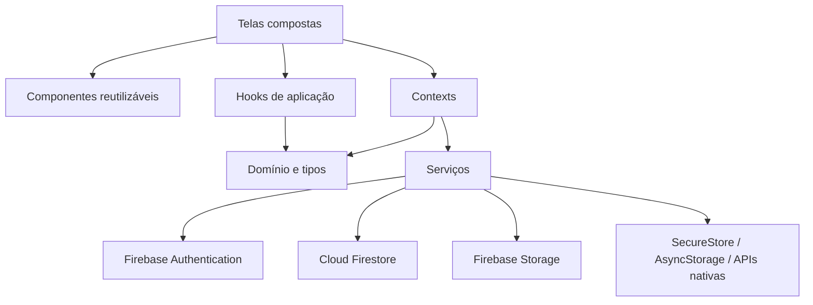

# Arquitetura

O projeto utiliza uma **arquitetura componentizada em React Native**, organizada por funcionalidades e camadas de responsabilidade. As telas combinam componentes reutilizáveis; hooks, contextos e serviços concentram cálculos, estado compartilhado e integrações.

O objetivo é evoluir cada responsabilidade sem concentrar toda a interface e a lógica em um componente único.

## O que significa componentização neste projeto

- **Componentes de interface:** botões, inputs, cards, seletores e gráficos recebem dados por props e comunicam interações por callbacks.
- **Telas:** compõem a interface, controlam formulários e coordenam navegação e operações.
- **Hooks:** reutilizam cálculos e filtros, como `useDashboardSummary` e `useTransactionFilters`.
- **Contextos:** compartilham sessão e transações entre telas sem repetir assinaturas Firebase.
- **Serviços:** isolam persistência, upload, rascunhos e autenticação biométrica.
- **Tipos e tema:** mantêm contratos de dados e linguagem visual consistentes.

A componentização trata da organização do código e da composição da interface. O projeto continua sendo distribuído como um aplicativo Expo; isso não exige que cada componente tenha um build ou deploy próprio. Não há carregamento de módulos remotos ou microfrontends implementado.

## Visão geral



## Camadas

| Camada | Diretórios | Papel |
|---|---|---|
| Apresentação | `src/screens`, `src/components`, `src/presentation`, `src/features` | Renderização, interação e composição das telas |
| Aplicação | `src/application` e hooks das features | Cálculos, filtros e casos de uso consumidos pela UI |
| Estado | `src/contexts` | Sessão autenticada e assinatura de movimentações |
| Domínio | `src/domain`, `src/types` | Contratos de autenticação, movimentação e navegação |
| Infraestrutura | `src/services` | Firebase, armazenamento local e biometria |
| Compartilhado | `src/shared`, `src/theme` | Formatação, componentes e tokens visuais |

## Composição da aplicação

O componente raiz registra os provedores nesta ordem:

```tsx
<SafeAreaProvider>
  <AuthProvider>
    <TransactionsProvider>
      <NavigationContainer>
        <AppNavigator />
      </NavigationContainer>
    </TransactionsProvider>
  </AuthProvider>
</SafeAreaProvider>
```

O `TransactionsProvider` depende da identidade exposta pelo `AuthProvider`; por isso ele deve permanecer aninhado dentro do provedor de autenticação.

`StatusBar` é configurada com estilo escuro. A aplicação utiliza `SafeAreaProvider`, mas apenas componentes que consomem os insets, como `AppHeader` e a barra de abas, aplicam esse espaçamento diretamente.

## Exemplo real de composição: histórico

`TransactionsScreen` combina responsabilidades já separadas no código:

```text
TransactionsScreen
├── useTransactions → dados compartilhados
├── useTransactionFilters → busca e filtros
├── useDashboardSummary → totais do conjunto filtrado
└── ScreenContainer
    ├── AppText → títulos e indicadores
    ├── FilterChip → opções de filtro
    └── AppCard
        ├── SectionHeader → título da lista
        ├── EmptyState → carregamento ou vazio
        └── TransactionListItem → movimentação e callbacks
```

O item não consulta o Firestore nem decide a navegação. Ele recebe a transação e callbacks; a tela coordena edição e confirmação de exclusão. Para implementar interfaces seguindo esse padrão, consulte o [guia dos 17 componentes](./componentes.md).

## Como evoluir sem concentrar responsabilidades

1. Reutilize um componente existente antes de criar outro.
2. Extraia blocos de uma tela quando tiverem responsabilidade própria ou uso repetido.
3. Defina props e callbacks tipados, mantendo o estado no nível que precisa compartilhá-lo.
4. Extraia cálculos reutilizáveis para hooks e acesso externo para serviços.
5. Documente o contrato e um exemplo no guia de componentes.

Essa separação é gradual: algumas validações e coordenações ainda ficam nas telas. `AppHeader` é um componente conectado ao contexto de autenticação, enquanto componentes como `PrimaryButton` e `FormField` não dependem dele. As fachadas em `features` e `presentation` reexportam implementações; não representam aplicações independentes.

## Decisões importantes

- O UID do usuário autenticado no Firebase é usado como `userId` nos documentos de movimentação e no caminho dos recibos.
- A consulta Firestore filtra apenas por usuário e ordena no cliente, evitando a necessidade de índice composto.
- Hooks de aplicação mantêm cálculos e filtros fora dos componentes visuais.
- Interfaces de feature reexportam implementações existentes para permitir evolução gradual sem quebrar imports.
- O mesmo código atende Android, iOS e Web, com ramificações somente quando uma API depende da plataforma.
- O custom scheme `alecrimwallet` está configurado para deep links de abertura; o mapeamento de URLs para telas ainda não foi declarado no `NavigationContainer`.

Consulte [Configuração Expo](./configuracao-expo.md) para identidade do aplicativo, orientação, tema e APIs nativas configuradas.
