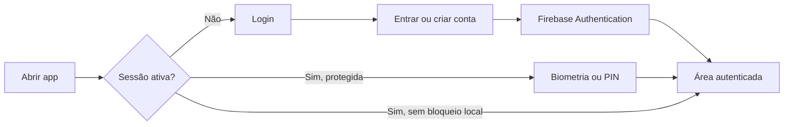

# Fluxos do usuário

## Cadastro e entrada

## Registrar uma movimentação

1. Acesse a aba **Adicionar**.
2. Selecione o tipo da movimentação.
3. Informe descrição, valor, data e categoria.
4. Opcionalmente, selecione uma imagem JPG/PNG ou um documento PDF.
5. Toque em **Salvar transação**.
6. O Firestore publica a alteração e a assinatura em tempo real atualiza dashboard e histórico.

## Editar ou excluir

As ações ficam disponíveis em cada item do dashboard e do histórico. A edição abre o formulário preenchido e a exclusão exige confirmação antes de remover definitivamente o documento do Firestore.

## Alterar cadastro

1. Toque no avatar no cabeçalho autenticado.
2. Atualize o nome completo e toque em **Salvar alterações**.
3. Se necessário, use **Enviar link para redefinir senha**.

O e-mail é exibido, mas não pode ser alterado nessa tela porque identifica os documentos de transação e os caminhos dos anexos no modelo atual.

## Filtrar o histórico

1. Digite parte da descrição no campo de busca.
2. Abra o painel de filtros.
3. Combine período, tipo e categoria.
4. Consulte entradas, saídas e resultado já recalculados para o conjunto filtrado.
5. Use **Limpar filtros** para remover período, tipo e categoria. O texto da busca permanece; apague-o também para retornar à listagem completa.
